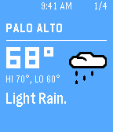

# Cards Example

This example shows how to implement a really cool cards based app. It demonstrates the use of the new Pebble Draw Commands API, which allows you to draw and animate vector graphics on Pebble.



## Tools

The [SVG2PDC](./tools/svg2pdc.py) script converts SVG images to a PDC (Pebble Draw Command) binary format image or sequence.

#### Usage

First install all the python dependencies

```sh
pip install -r requirements.txt
```

Then use the [SVG2PDC](./tools/svg2pdc.py) tool to convert an SVG to PDC. Note that this will generate the PDC in the same directory as the source file (SVG).

```sh
python tools/svg2pdc.py resources/Pebble_50x50_Generic_weather.svg
```

## Testing

Change the `BACKGROUND_SCROLL_DURATION` and `SCROLL_DURATION` in [weather_app.c](./src/weather_app.c) to see what's happening under the hood.

## License

[MIT](./LICENSE)
